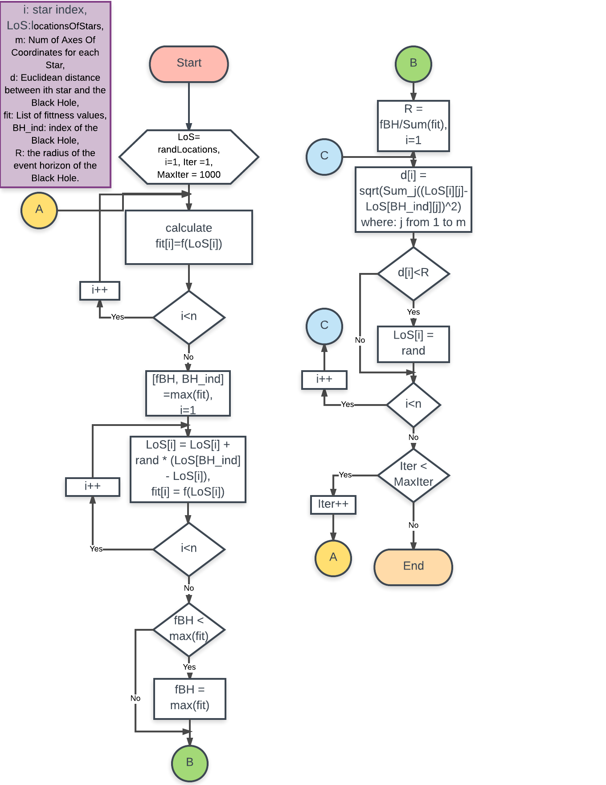

# Black-Hole-Algorithm-Implementation

### Written By: Mohamad Al Mdfaa

**Black hole: A new heuristic optimization approach for data clustering**

## Youtube Video Link:

# Black Hole Metaheuristic Algorithm Steps:

## 1.Initialization

•Initialize a population of Stars (Candidate Solutions) with random locations in the search space.

## 2.Search for the Black Hole (Best Solution)

**Main Loop**

### 1.Evaluation:  evaluate the Objective Function for each Star.
### 2.Selection of The Black Hole: select the Best Star that has the Best (Maximum) Fitness value as the Black Hole.
### 3.Change the location of each Star according to this Equation:

x(BH−xi(t))xi(t+1)=xi(t)+rand×i=1,2,….,N(theNumberofStars)

### 4.If a Star reaches a location with lower cost than the Black Hole, exchange their locations.
### 5.If a star crosses the Event Horizon (R) of the Black Hole, replace it with a new Star in a random location in the Search Space.

R=fBH∑i=1Nfi

fBHisthefitnessvalueofthehole.

fiisthefitnessvalueoftheStarith

### 6.Termination Criterion: If a termination criterion (maximum number of  iteration or a sufficiently good fitness) is met, exit the loop, **Otherwise Repeat the Main Loop Steps.**

## The Experiment Results:

### When Seed = 1:

### Objective Function (f1):

**BestSolution is: 0.0012628   0.0012626   0.0012627   0.0012626   0.0012627   0.0012627   0.0012626   0.0012626   0.0012626   0.0012627**

**BestCost is: -1.5944e-05**

### Objective Function (f2):

BestSolution is: 0.35263     0.33042     0.35099     0.35192     0.32548     0.35101     0.33843     0.30527     0.33845     0.34983

BestCost is: -918538.124

### When Seed = 2:

### Objective Function (f1):

BestSolution is: 1.4672e-07  1.4672e-07  1.4672e-07  1.4672e-07  1.4672e-07  1.4672e-07  1.4672e-07  1.4672e-07  1.4672e-07  1.4672e-07

BestCost is: -2.1526e-13

### Objective Function (f2):

BestSolution is: 0.3372     0.28684       0.317     0.32101     0.23983     0.32667     0.31183     0.39994      0.3268     0.29392

### When Seed = 3:

### Objective Function (f1):

BestSolution is: 0.00085355  0.00085361  0.00085373  0.00085362  0.00085361  0.00085351  0.00085351  0.00085376  0.00085361  0.00085384

BestCost is: -7.2869e-06

### Objective Function (f2):

BestSolution is: 0.012472    0.012334    0.012374    0.012373    0.012242    0.012298    0.012317    0.012257    0.012412    0.012181

BestCost is: -1330.4517

### When Seed = 4:

### Objective Function (f1):

BestSolution is: 0.00039626  0.00039622  0.00039621  0.00039629  0.00039631   0.0003963  0.00039628  0.00039624  0.00039628  0.00039627

BestCost is: -1.5703e-06

### Objective Function (f2):

BestSolution is: 0.39149     0.51041      0.4825     0.31508     0.36814     0.25724     0.53221     0.27891     0.30046     0.67877

BestCost is: -1706338.6363 

### When Seed = 5:

### Objective Function (f1):

BestSolution is: 0.12744     0.12481     0.12538      0.1255     0.12581     0.12357     0.12473     0.12606     0.12513     0.12649

BestCost is: -0.15388

### Objective Function (f2):

BestSolution is: 0.23316     0.22884     0.23142     0.23138     0.22873     0.22866     0.21886     0.22705     0.22888      0.2326

BestCost is: -470000.984

## The Final Results:

1. Seed#2 &amp; seed#3 give us good results with objective functions f1 and f2 respectively.
2. Since f1 is a Convex Cost Function, so we get very good results. In other hand, f2 is non convex function so the algorithm struggles to find best cost but almost it stuck in a local minima.

Note: I suggest a modification on the algorithm to solve and pass this problem.

1. In our Experiments we try 5 seeds. As a result of those 5 experiments I conclude that Black Hole Algorithm depends somewhat on the initial setting of stars (candidate solutions).

## Eq.3. from [0, 1] to merely [0, 0.3] Effect:

However I attach my suggestion with an experiment on the objective function **f2** since I use seed#5 which have gotten us the worst results, but now after the adjustment I got this results:

**When maxIter = 100**

BestSolution is: -0.0010155  -0.0003739  3.6752e-05  5.0902e-05 -0.00026473 -0.00039566   0.0001019  0.00044734  0.00036059  0.00037904

BestCost is: -0.85456

**When maxIter = 500**

BestSolution is: 9.416e-06   9.416e-06   9.416e-06   9.416e-06   9.416e-06   9.416e-06   9.416e-06   9.416e-06   9.416e-06   9.416e-06

BestCost is: **-0.00079795**

